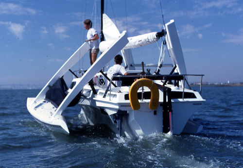
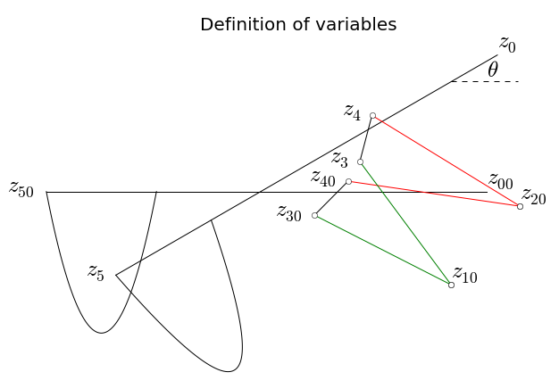
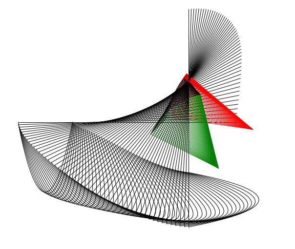
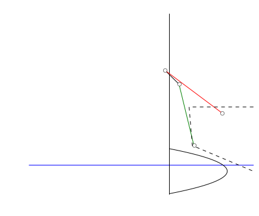

The art of folding boats
========================

The `Farrier folding
system <http://www.f-boat.com/pages/introduction/folding.html>`__ is a
popular design for folding trimarans. The system is elegant but tweaking
the precise geometry of the linkages when adopting the system for your
own design can be tricky. This is because the folded geometry is
sensitive to the locations of the hinge points at the same time it is
difficult to understand exactly how without some kinematic analysis.

The design parameters are the coordinates of the points shown in the
following diagram

It is convenient to work with complex numbers. The kinematic constrains
of the system are:

.. math::

   | z_{1} - z_{3} | = | z_{10} - z_{30} |

.. math::

   | z_{4} - z_{2} | = | z_{40} - z_{20} |

.. math::

   z_{0} + (z_{30} - z_{00}) e^{i \theta} = z_{3}

.. math::

   z_{0} + (z_{40} - z_{00}) e^{i \theta} = z_{4}

Solving this system will give us the transformation
:math:`z \to z_0 + z e^{i\theta}` where :math:`z` is a coordinate
expressed in the frame coordinates (centered at :math:`z_0`) and the
result is expressed in the global coordinates

.. raw:: html

    

    <table border="1" class="dataframe">
      <thead>
        <tr style="text-align: right;">
          <th></th>
          <th>x (mm)</th>
          <th>y (mm)</th>
        </tr>
        <tr>
          <th>point</th>
          <th></th>
          <th></th>
        </tr>
      </thead>
      <tbody>
        <tr>
          <th>z00</th>
          <td> -700</td>
          <td> 1000</td>
        </tr>
        <tr>
          <th>z10</th>
          <td> -927</td>
          <td>  407</td>
        </tr>
        <tr>
          <th>z20</th>
          <td> -489</td>
          <td>  907</td>
        </tr>
        <tr>
          <th>z30</th>
          <td>-1796</td>
          <td>  850</td>
        </tr>
        <tr>
          <th>z40</th>
          <td>-1582</td>
          <td> 1066</td>
        </tr>
        <tr>
          <th>z50</th>
          <td>-3500</td>
          <td> 1000</td>
        </tr>
      </tbody>
    </table>
    

Let's see how it looks when we fold this configuration. Lets plot this
configuration for 50 values of :math:`\theta \in (0, \pi/2)`. We see
that with this framework it is easy to make modern art.

I will here make an attempt at utilizing IPythons new interact feature
to allow the analyst to see how a parameter affects the end result.

